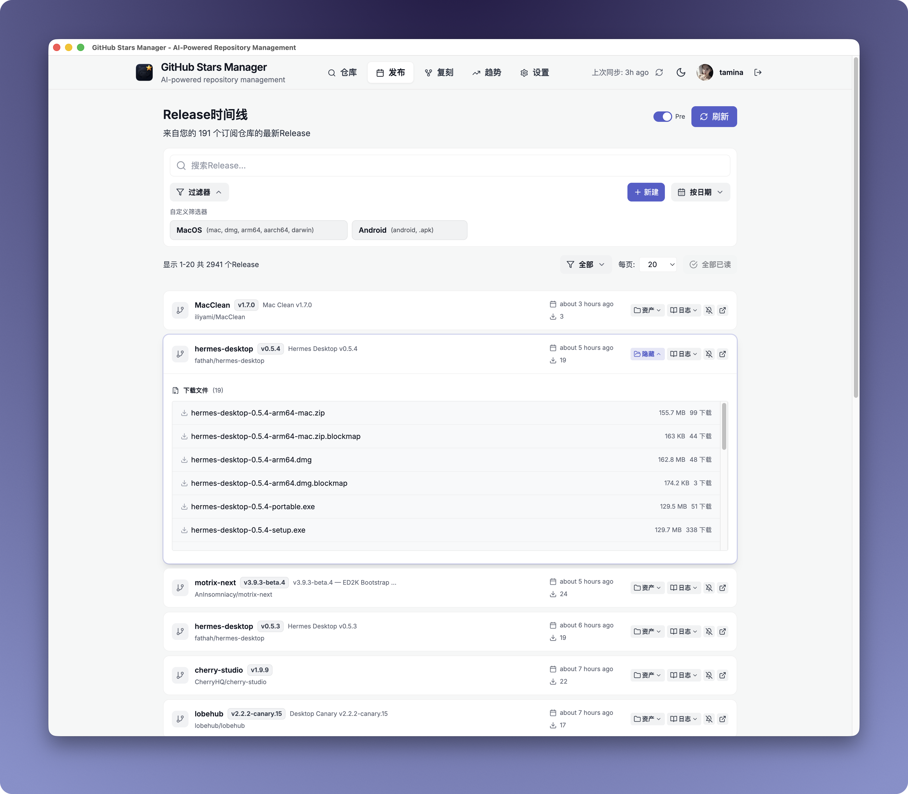
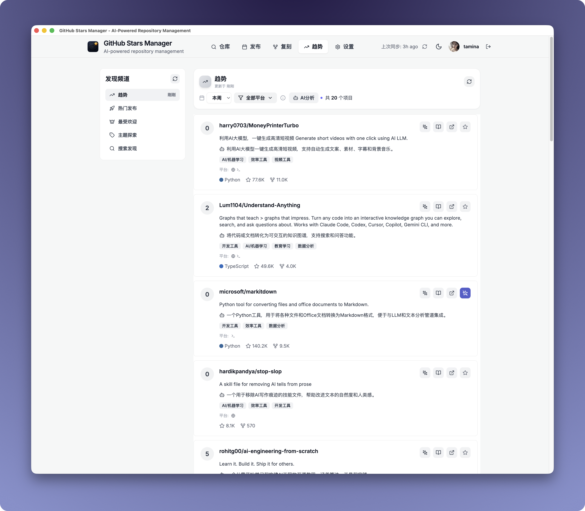
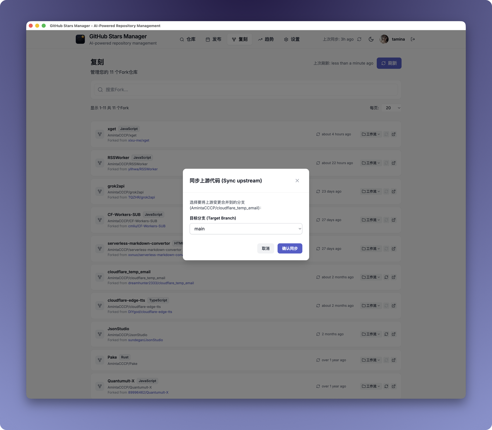
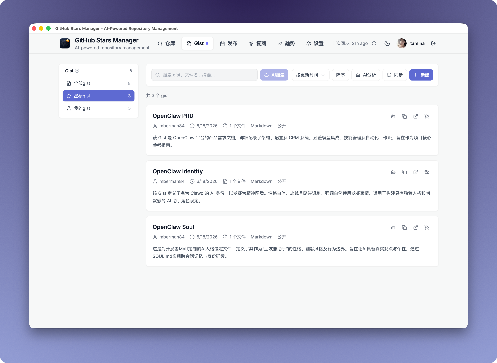
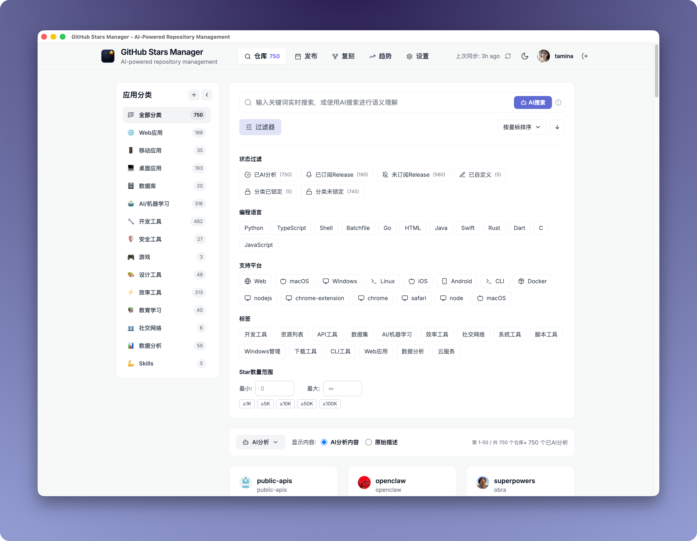
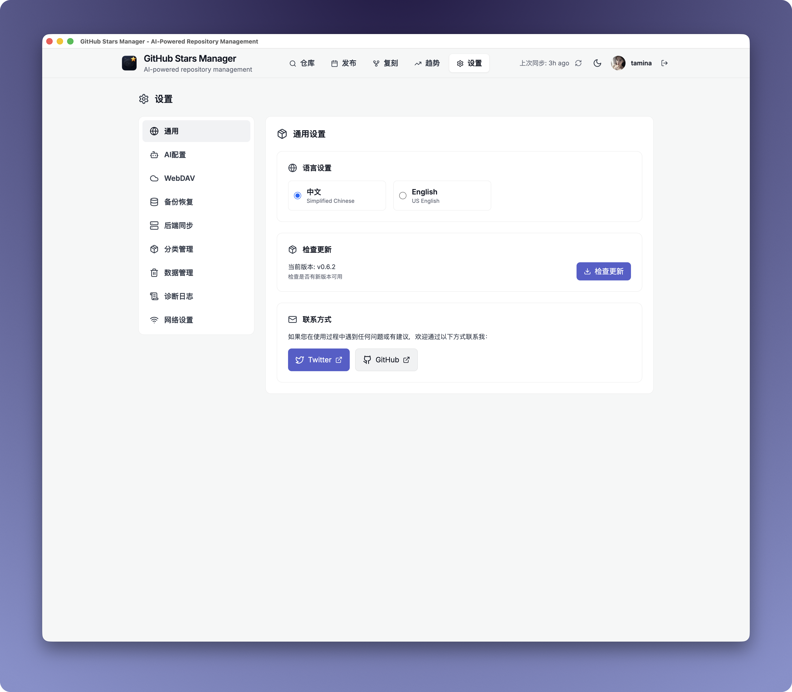
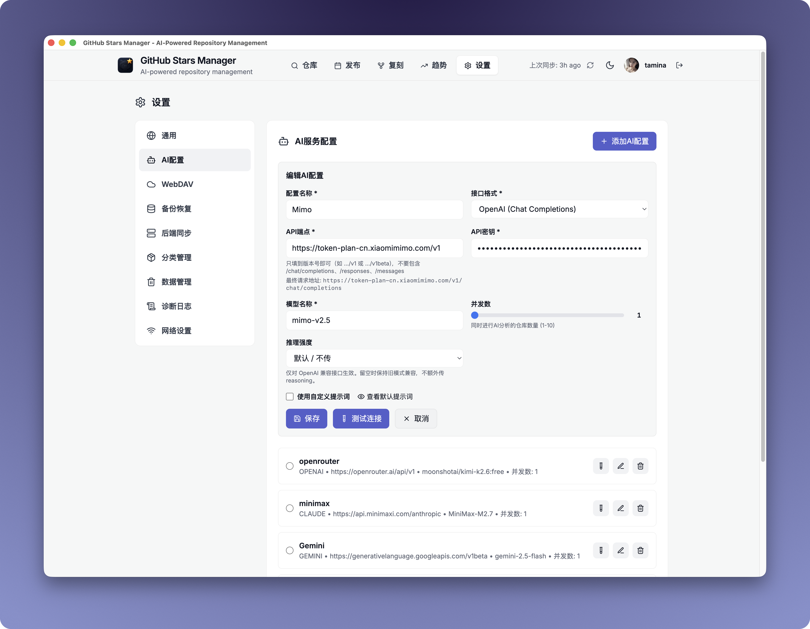

<div align="center">


# GithubStarsManager

   [![zread](https://img.shields.io/badge/Ask_Zread-_.svg?style=flat&color=00b0aa&labelColor=000000&logo=data%3Aimage%2Fsvg%2Bxml%3Bbase64%2CPHN2ZyB3aWR0aD0iMTYiIGhlaWdodD0iMTYiIHZpZXdCb3g9IjAgMCAxNiAxNiIgZmlsbD0ibm9uZSIgeG1sbnM9Imh0dHA6Ly93d3cudzMub3JnLzIwMDAvc3ZnIj4KPHBhdGggZD0iTTQuOTYxNTYgMS42MDAxSDIuMjQxNTZDMS44ODgxIDEuNjAwMSAxLjYwMTU2IDEuODg2NjQgMS42MDE1NiAyLjI0MDFWNC45NjAxQzEuNjAxNTYgNS4zMTM1NiAxLjg4ODEgNS42MDAxIDIuMjQxNTYgNS42MDAxSDQuOTYxNTZDNS4zMTUwMiA1LjYwMDEgNS42MDE1NiA1LjMxMzU2IDUuNjAxNTYgNC45NjAxVjIuMjQwMUM1LjYwMTU2IDEuODg2NjQgNS4zMTUwMiAxLjYwMDEgNC45NjE1NiAxLjYwMDFaIiBmaWxsPSIjZmZmIi8%2BCjxwYXRoIGQ9Ik00Ljk2MTU2IDEwLjM5OTlIMi4yNDE1NkMxLjg4ODEgMTAuMzk5OSAxLjYwMTU2IDEwLjY4NjQgMS42MDE1NiAxMS4wMzk5VjEzLjc1OTlDMS42MDE1NiAxNC4xMTM0IDEuODg4MSAxNC4zOTk5IDIuMjQxNTYgMTQuMzk5OUg0Ljk2MTU2QzUuMzE1MDIgMTQuMzk5OSA1LjYwMTU2IDE0LjExMzQgNS42MDE1NiAxMy43NTk5VjExLjAzOTlDNS42MDE1NiAxMC42ODY0IDUuMzE1MDIgMTAuMzk5OSA0Ljk2MTU2IDEwLjM5OTlaIiBmaWxsPSIjZmZmIi8%2BCjxwYXRoIGQ9Ik0xMy43NTg0IDEuNjAwMUgxMS4wMzg0QzEwLjY4NSAxLjYwMDEgMTAuMzk4NCAxLjg4NjY0IDEwLjM5ODQgMi4yNDAxVjQuOTYwMUMxMC4zOTg0IDUuMzEzNTYgMTAuNjg1IDUuNjAwMSAxMS4wMzg0IDUuNjAwMUgxMy43NTg0QzE0LjExMTkgNS42MDAxIDE0LjM5ODQgNS4zMTM1NiAxNC4zOTg0IDQuOTYwMVYyLjI0MDFDMTQuMzk4NCAxLjg4NjY0IDE0LjExMTkgMS42MDAxIDEzLjc1ODQgMS42MDAxWiIgZmlsbD0iI2ZmZiIvPgo8cGF0aCBkPSJNNCAxMkwxMiA0TDQgMTJaIiBmaWxsPSIjZmZmIi8%2BCjxwYXRoIGQ9Ik00IDEyTDEyIDQiIHN0cm9rZT0iI2ZmZiIgc3Ryb2tlLXdpZHRoPSIxLjUiIHN0cm9rZS1saW5lY2FwPSJyb3VuZCIvPgo8L3N2Zz4K&logoColor=ffffff)](https://zread.ai/AmintaCCCP/GithubStarsManager)

一个基于AI的GitHub星标仓库管理工具，帮助您更好地组织和管理您的GitHub星标项目。

<a href="https://www.producthunt.com/products/githubstarsmanager?embed=true&utm_source=badge-featured&utm_medium=badge&utm_source=badge-githubstarsmanager" target="_blank"></a>

</div>

中文 | **[English](README.md)**

## 功能特性

> 星标太多找不到？GitHub Stars Manager 自动同步您的星标仓库，使用 AI 进行摘要和分类，支持语义搜索。追踪 Release、过滤资产、一键下载——比手动标签更智能，比 GitHub 更简单。

### 核心功能

| 功能 | 描述 |
|------|------|
| **自动同步星标** | 连接 GitHub Token 自动拉取所有星标仓库 |
| **AI 摘要与分类** | 使用 AI 生成标签、主题和简短 README 概览 |
| **语义搜索** | 按意图而非精确名称查找仓库 |
| **向量语义搜索** | 将仓库描述/README 嵌入 Cloudflare Vectorize 向量库，自然语言查询实现高精度语义匹配 |
| **Release 追踪** | 订阅仓库并在统一时间线查看新版本 |
| **一键下载** | 展开 Release 资产并即时下载 |
| **智能资产过滤** | 按关键词匹配资产 (dmg / mac / arm64 / aarch64) |
| **发现中心** | 浏览 GitHub 趋势、热门发布、最受欢迎项目 |
| **Fork 管理** | 查看、同步 Fork 仓库并触发 GitHub Actions 工作流 |
| **Gist 管理** | 浏览、创建、编辑、删除 Gist；AI 摘要与语义搜索 |
| **网络代理** | HTTP / SOCKS5 代理支持，协议级连接探测测试 |
| **远程下载 (aria2)** | 通过 aria2 JSON-RPC 将 Release 资产推送到远程下载 |
| **诊断日志** | 前后端统一日志查看器，支持 Debug 捕获模式 |
| **双语 Wiki 跳转** | 根据仓库语言跳转到 Deepwiki (EN) 或 zread (ZH) |
| **客户端打包** | 无需配置环境，下载即用 |

### 可选后端服务

部署 Express + SQLite 后端以实现：

- **跨设备同步** — 在不同浏览器和设备间共享数据
- **无 CORS 代理** — AI 和 WebDAV 请求通过服务器转发，避免浏览器 CORS 限制
- **加密令牌存储** — API 密钥安全存储，不暴露在浏览器中
- **网络代理转发** — 所有出站请求（GitHub、AI、WebDAV）通过 HTTP/SOCKS5 代理转发
- **RPC 下载代理** — 通过服务器转发 aria2 下载请求，密钥加密存储

---

## 🔍 界面预览

### 1. 仓库管理 (`Stars` 视图)

**功能列表：**
- **自动同步** — 连接 GitHub Token 自动拉取所有星标仓库
- **AI 批量分析** — 批量选择仓库，使用 AI 自动生成描述、标签和分类；支持暂停/继续分析进度
- **仓库卡片展示** — 显示 star 数、fork 数、编程语言、主分支状态；支持展开 README 预览
- **分类侧边栏** — 拖拽排序分类、自定义分类颜色、折叠/展开侧边栏；支持锁定分类防止 AI 覆盖
- **批量操作工具栏** — 批量归类到指定分类、批量恢复 AI 分析结果
- **订阅指示器** — 直观显示哪些仓库已订阅 Release 更新
- **AI 分析状态** — 显示已分析/未分析/分析失败状态；支持按分析状态筛选

**截图：**


---

### 2. Release 时间线 (`Releases` 视图)

**功能列表：**
- **订阅管理** — 订阅/取消订阅仓库的 Release 通知；支持批量取消订阅
- **时间线展示** — 按时间倒序列出所有仓库的新版本发布；显示已读/未读状态
- **智能资产过滤** — 按平台筛选 (macOS / Windows / Linux / ARM)；按文件类型筛选 (dmg / zip / deb / rpm / apk)
- **自定义过滤规则** — 保存自定义关键词过滤规则
- **展开下载** — 展开 Release 资产列表，一键复制下载链接；显示文件大小
- **多视图模式** — 列表视图 / 网格视图切换
- **分页加载** — 支持分页加载历史发布记录
- **刷新状态指示** — 显示最后刷新时间

**截图：**


---

### 3. 发现中心 (`Discover` 视图)

**功能列表：**
- **五大发现渠道** — 趋势(Trending) / 热门发布(Hot Release) / 最受欢迎(Most Popular) / 话题(Topic) / 搜索(Search)
- **趋势时间范围** — 今日 / 本周 / 本月 三个时间维度
- **趋势筛选规则** — 更新时间 30 天内，Star 数 50+，按 Star 降序排列
- **平台过滤** — 按操作系统筛选 (All / macOS / Windows / Linux / Browser)
- **编程语言过滤** — 按语言筛选 (JavaScript / TypeScript / Python / Go / Rust 等)
- **AI 仓库分析** — 一键对发现频道中的仓库进行 AI 分析
- **订阅仓库** — 将感兴趣的仓库加入订阅列表
- **移动端适配** — 移动设备友好的频道切换体验

> 趋势数据来源于 GitHub 趋势 RSS 源，每 30 分钟自动更新。适合发现新兴热门项目、追踪技术趋势、寻找学习方向。

**截图：**


---

### 4. Fork 管理 (`Forks` 视图)

**功能列表：**
- **Fork 列表** — 自动获取所有 Fork 仓库，检测上游更新
- **一键同步** — 将上游变更合并到任意分支，处理冲突
- **GitHub Actions** — 在 Fork 卡片上直接查看和触发工作流
- **未读/已读追踪** — 上游有新提交的 Fork 显示脉冲指示器
- **搜索与分页** — 全文搜索、可配置分页大小

**Screenshot:**


---

### 5. Gist 管理 (`Gist` 视图)

**功能列表：**
- **Gist 列表** — 自动同步所有 Gist 和星标 Gist，支持分类筛选（全部 / 我的 / 星标）
- **创建与编辑** — 多文件 Gist 编辑器，支持语法高亮代码块；可添加、重命名、删除文件
- **AI 分析** — 一键 AI 摘要 Gist 内容；支持批量分析与暂停/继续
- **语义搜索** — AI 搜索重排序，按意图查找 Gist，而非仅按文件名
- **详情查看** — 可展开的 Gist 详情弹窗，显示文件内容、语法高亮和一键复制
- **Star 与 Unstar** — 在卡片上直接 Star/Unstar Gist
- **智能筛选** — 按分析状态、语言筛选，按名称/日期/文件数排序

**截图：**


---

### 6. 搜索与过滤

**功能列表：**
- **多维度搜索** — 关键词搜索、仓库状态筛选、标签筛选、语言筛选、平台筛选
- **AI 分析状态筛选** — 已分析 / 未分析 / 分析失败 / 已编辑
- **Release 订阅筛选** — 已订阅 / 未订阅 Release
- **分类状态筛选** — 分类已锁定 / 未锁定
- **快捷键支持** — 显示搜索快捷键提示
- **搜索统计** — 显示搜索结果数量和筛选条件
- **搜索演示模式** — 展示语义搜索能力

**截图：**


---

### 7. 设置面板

**设置分组：**

| 分组 | 功能 |
|------|------|
| **General** | 语言切换 (中/英)、主题设置 |
| **AI Config** | 配置 OpenAI / Anthropic / Ollama / 兼容 API；支持自定义端点和密钥 |
| **WebDAV** | 坚果云、Nextcloud、ownCloud 等标准 WebDAV 服务备份配置 |
| **Backup** | 备份历史记录、手动备份/恢复、增量备份 |
| **Backend Server** | 连接自建后端服务、API 密钥验证、同步状态指示 |
| **Network** | HTTP/SOCKS5 代理配置及协议级测试；aria2 RPC 远程下载设置 |
| **Category** | 分类管理、分类排序、默认分类覆盖规则 |
| **Data Management** | 数据导入/导出、清除本地数据、重置所有数据 |
| **向量搜索** | 配置 Cloudflare Vectorize Worker、Embedding 模型、索引模式（描述/README）、索引重建管理 |

**截图：**


---

### 8. 自定义 AI 模型

**功能列表：**
- **多 AI 提供商支持** — OpenAI (GPT-3.5/GPT-4)、Anthropic (Claude)、Ollama (本地模型)、任何兼容 OpenAI 接口的 API
- **自定义端点** — 支持私有部署的 AI 服务
- **连接测试** — 配置后测试 API 连接是否可用
- **AI 模型选择** — 选择要使用的具体模型

**截图：**


## 技术栈

- **前端**: React 18 + TypeScript + Tailwind CSS
- **状态管理**: Zustand
- **图标**: Lucide React + Font Awesome
- **构建工具**: Vite
- **部署**: Netlify

## 💻 桌面客户端（推荐）

直接下载桌面客户端，无需配置环境：

https://github.com/AmintaCCCP/GithubStarsManager/releases

## 快速开始

### 1. 克隆项目
```bash
git clone https://github.com/AmintaCCCP/GithubStarsManager.git
cd GithubStarsManager
```

### 2. 安装依赖
```bash
npm install
```

### 3. 启动开发服务器
```bash
npm run dev
```

> 💡 本地使用 `npm run dev` 运行项目时，AI 服务和 WebDAV 的调用可能因浏览器 CORS 限制而失败。建议使用预编译客户端，或启动后端服务器（`cd server && npm run dev`）代理 API 请求以完全避免 CORS 问题。

### 4. 构建生产版本
```bash
npm run build
```

## 🤖 AI服务配置

应用支持多种AI服务提供商：

- **OpenAI**: GPT-3.5/GPT-4
- **Anthropic**: Claude
- **本地部署**: Ollama等本地AI服务
- **其他**: 任何兼容OpenAI API的服务

在设置页面中配置您的AI服务：
1. 添加AI配置
2. 输入API端点和密钥
3. 选择模型
4. 测试连接

## 🌐 网络代理配置

应用支持通过代理路由所有出站请求：

- **HTTP 代理** — 标准 HTTP CONNECT 隧道，支持可选认证
- **SOCKS5 代理** — 完整 SOCKS5 支持，包括用户名/密码认证 (RFC 1929)
- **协议级测试** — 连接测试执行真实的协议握手，而非简单 TCP 连接
- **加密存储** — 代理密码使用 AES-256-GCM 加密存储

在设置 → 网络标签页中配置（Electron 客户端或后端服务器可用时显示）。

## ⬇️ 远程下载 (aria2 RPC)

将 Release 下载链接直接发送到 aria2 守护进程：

1. 启用 aria2 RPC：`aria2c --enable-rpc --rpc-listen-port=6800`
2. 打开设置 → 网络 → 远程下载
3. 输入主机、端口和可选密钥
4. 测试连接后保存
5. Release 资产按钮将自动把下载任务推送到 aria2

支持有后端和纯前端两种模式（浏览器直连 aria2）。

## 🧠 向量语义搜索（可选）

向量语义搜索基于 [Cloudflare Vectorize](https://developers.cloudflare.com/vectorize/) 提供高精度的自然语言搜索。将仓库描述（或完整 README 内容）嵌入为向量，通过语义相似度匹配，而非关键词匹配。

**工作原理：**
1. 前端通过用户配置的 Embedding 服务商（OpenAI、Gemini、Cohere、Ollama、硅基流动或任何兼容 OpenAI 的 API）生成向量
2. 轻量级 Cloudflare Worker 作为纯 Vectorize 代理（存/查/删）
3. 搜索时，将查询文本嵌入为向量并与索引匹配；可选由 AI 服务进行二次排序
4. 关闭向量搜索或搜索失败时，自动回退到基于关键词的 AI 搜索

**支持的 Embedding 服务商：**

| 服务商 | 模型 | 维度 |
|--------|------|------|
| OpenAI | text-embedding-3-small / large | 1536 / 3072 |
| Gemini | text-embedding-004 | 768 |
| Cohere | embed-multilingual-v3.0 | 1024 |
| Ollama | nomic-embed-text / bge-m3 | 768 / 1024 |
| 硅基流动 | BAAI/bge-large-zh-v1.5 | 1024 |
| OpenAI 兼容 | （自定义） | （自定义） |

**快速配置：**
1. 部署 Cloudflare Worker — 详见 [cloudflare-worker/README.md](cloudflare-worker/README.md)
2. 在应用中：**设置 → 向量搜索** — 填入 Worker 地址和认证 Token
3. 配置 Embedding 服务商（API Key + 模型）
4. 点击 **重建索引** 将所有仓库嵌入并上传
5. 使用 **AI 搜索** 按钮 — 启用后自动走向量搜索

> ⚠️ 更换 Embedding 模型后必须重建索引 — 不同模型生成的向量维度不兼容。

## 💾 WebDAV备份配置

支持多种WebDAV服务：
- **坚果云**: 国内用户推荐
- **Nextcloud**: 自建云存储
- **ownCloud**: 企业级解决方案
- **其他**: 任何标准WebDAV服务

配置步骤：
1. 在设置页面添加WebDAV配置
2. 输入服务器URL、用户名、密码和路径
3. 测试连接
4. 启用自动备份

## 🚀 部署

### Netlify部署
1. Fork本项目到您的GitHub账户
2. 在Netlify中连接您的GitHub仓库
3. 配置构建设置：
   - Build command: `npm run build`
   - Publish directory: `dist`
4. 部署

### 其他平台
项目构建后生成静态文件，可以部署到任何静态网站托管服务：
- Vercel
- GitHub Pages
- Cloudflare Pages
- 自建服务器

### Docker 部署

GHCR 上有预构建的后端镜像，无需本地构建：

```bash
docker pull ghcr.io/amintacccp/github-stars-manager-server:latest
docker-compose up -d
```

> 如果镜像为私有，需先执行 `docker login ghcr.io`（使用具有 `read:packages` 权限的 [PAT](https://github.com/settings/tokens)）。

请参阅 [DOCKER.md](DOCKER.md) 获取详细的构建和部署说明。Docker 设置正确处理了 CORS，并允许您直接在应用程序中配置任何 AI 或 WebDAV 服务 URL。

### 🖥️ 后端服务器（可选）

应用在没有后端的情况下也能完整运行（纯前端，使用 localStorage）。可选的 Express + SQLite 后端提供以下额外功能：

- **跨设备同步**: 在不同浏览器和设备间共享数据
- **无 CORS 代理**: AI 和 WebDAV 请求通过服务器转发，避免浏览器 CORS 限制
- **令牌安全**: API 密钥加密存储在服务器，不会暴露在浏览器网络请求中

#### 快速启动（推荐使用 Docker）
```bash
docker-compose up -d
```
前端运行在 8080 端口，后端运行在 3000 端口。数据持久化存储在 Docker 卷中。

自定义配置，创建 `.env` 文件：
```bash
API_SECRET=your-secret
ENCRYPTION_KEY=your-key
BACKEND_IMAGE_TAG=v0.6.2   # 固定版本（默认：latest）
```

#### 仅后端（docker run）
```bash
# 基础运行 — 无认证，端口 3000
docker run -d --name github-stars-backend \
  -v github-stars-data:/app/data \
  -p 3000:3000 \
  ghcr.io/amintacccp/github-stars-manager-server:latest

# 自定义密钥和端口
docker run -d --name github-stars-backend \
  -v github-stars-data:/app/data \
  -p 3000:3000 \
  -e API_SECRET="your-secret" \
  -e ENCRYPTION_KEY="your-key" \
  ghcr.io/amintacccp/github-stars-manager-server:latest
```

#### 手动启动
```bash
cd server
npm install
npm run dev
```

#### 环境变量
| 变量 | 必填 | 说明 |
|----------|----------|-------------|
| `API_SECRET` | 否 | API 认证令牌。未设置时禁用认证。 |
| `ENCRYPTION_KEY` | 否 | 用于加密存储密钥的 AES-256 密钥。未设置时自动生成。 |
| `PORT` | 否 | 服务器端口（默认：3000） |

#### 前端连接后端
1. 打开应用中的设置面板
2. 找到「后端服务器」部分
3. 输入 API Secret（如已配置）
4. 点击「测试连接」，绿色指示灯表示连接成功
5. 使用「同步到后端」/「从后端同步」来传输数据

## 目标用户

- 拥有数百甚至数千星标的开发者
- 系统性追踪软件发布的用户
- 不想手动打标签的「懒效率」用户

## 补充说明

1. 后端为可选项，但对于网页部署推荐启用。不启用时，所有数据存储在浏览器 localStorage 中，请定期备份重要数据。
2. 我不会写代码，这个应用完全由AI编写，主要满足我个人需求。如果您有新功能需求或遇到Bug，我只能尽力尝试，但无法保证成功，因为这取决于AI能否完成。😹

## 贡献

欢迎提交Issue和Pull Request！

1. Fork项目
2. 创建功能分支 (`git checkout -b feature/AmazingFeature`)
3. 提交更改 (`git commit -m 'Add some AmazingFeature'`)
4. 推送到分支 (`git push origin feature/AmazingFeature`)
5. 开启Pull Request

## 许可证

本项目采用MIT许可证 - 查看 [LICENSE](LICENSE) 文件了解详情。

## 支持

如果您觉得这个项目有用，请给它一个⭐️！

如有问题或建议，请提交Issue或联系作者。

## 星标地图

<a href="https://starmapper.bruniaux.com/AmintaCCCP/GithubStarsManager?utm_source=map-embed&utm_medium=readme&utm_campaign=stargazer-map">
  <picture>
    <source media="(prefers-color-scheme: dark)" srcset="https://starmapper.bruniaux.com/api/map-image/AmintaCCCP/GithubStarsManager?theme=dark" />
    <source media="(prefers-color-scheme: light)" srcset="https://starmapper.bruniaux.com/api/map-image/AmintaCCCP/GithubStarsManager?theme=light" />
    
  </picture>
</a>

## 星标历史

[](https://www.star-history.com/#AmintaCCCP/GithubStarsManager&Date)

